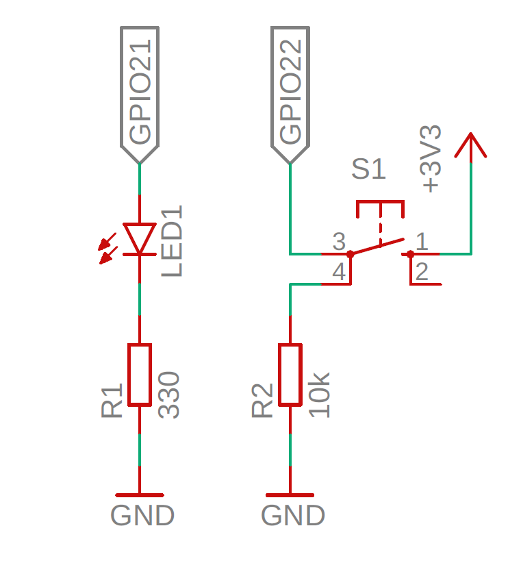

# jetson_nano_gpio_driver

Simple Device Driver for Jetson Nano

## Description
When you `insmod` this driver, `myled0` and `myswitch0` will appear in `/dev`.

`/dev/myled0` drives led connected to GPIO22  
`/dev/myswitch0` gets status connected to GPIO21

## Requirements

* Jetson Nano
* led
* resistor
  * 330[ohm]
  * 10k[ohm]
* switch

## Installation

### Hardware

Connect led, resistors, switch to GPIO of Jetson Nano as shown in schematic.



### Software

First, download this repository.

```
git clone https://github.com/Tiryoh/jetson_nano_gpio_driver.git
```

Next, move into `jetson_nano_gpio_driver` directory and run make command.

```
cd jetson_nano_gpio_driver
make && make install
```

## Usage

After installation, test gpio check scripts.  
The LED connected to GPIO22 will blink.

```
./scripts/test_gpio22.sh
```

If you want to turn on the LED when you push the switch button connected to GPIO21, run this command.

```
./scripts/sw_to_led.sh
```

## Reference

* https://github.com/rt-net/RaspberryPiMouse
* http://derekmolloy.ie/kernel-gpio-programming-buttons-and-leds/

## License

This repository is licensed under the GPLv3 license, see [LICENSE](./LICENSE).
